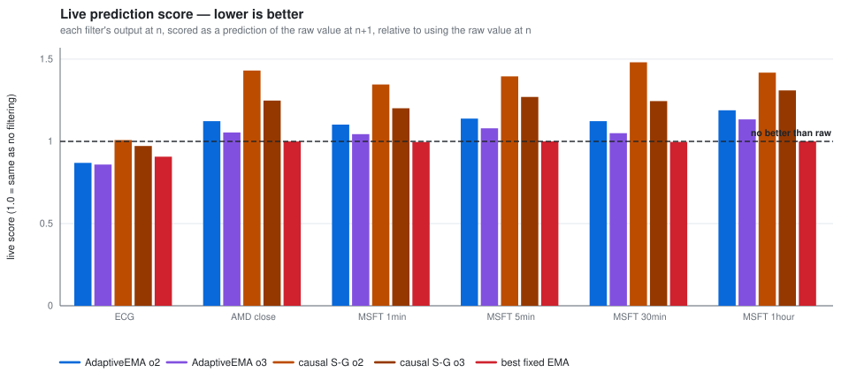
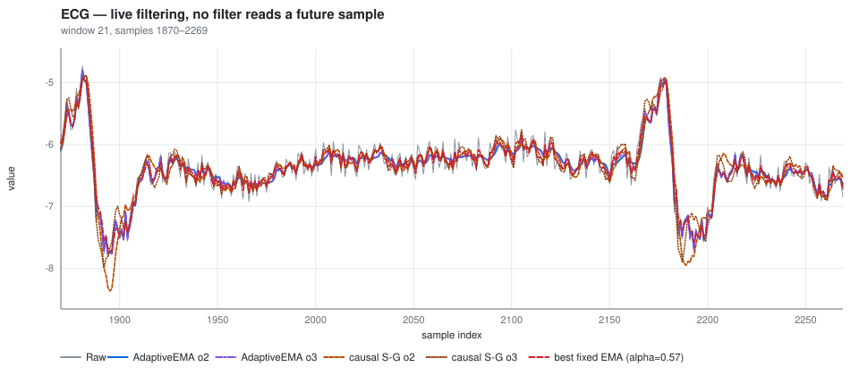
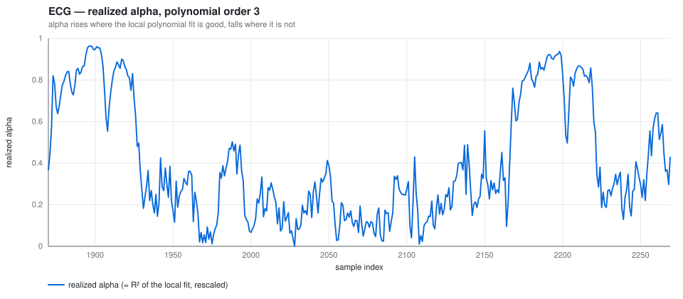

# AdaptiveEMA

The aim was to reduce the lag of exponential moving average via assessing r squared of polynomial fit.

## Usage:

1) Construct the parameters:
   
```csharp
// At minimum, window size is required, in this case the EMA decay factor will be in the range [0, 1], the polynomial order is 2
// Additionally, the EMA decay factor range can be specified and the polynomial order
var filterRunParameter = new RunParameters(10);
```

2) Construct the filter, and use it

```csharp
var filter = new RSquaredAdaptive(filterRunParameter);

var dataPoints = new double[] {1, 2, 3, 4, 5, 6, 7, 8, 9, 10};
var lastPointTransformed = filter.Transform(dataPoints);
```

## Getting the parameters:

In the AdaptiveEMA.Optimizer namespace there are `OptimizerHelper` and `OptimizerBuilder` which help to find the best decay factor range for a given data. By default, the Savitzky-Golay filter is used to smooth data points and the Nelder-Mead algorithm is used to maximize the coefficient of determination. However, the comparison data points and the evaluation function can be overridden by the builder.

```csharp
// Assuming we have some dataRaw as a double[], we take 25% of it for the train purpose
var trainSamples = dataRaw.Take((int)(dataRaw.Count * 0.25)).ToArray();

var optimizerParams = new OptimizerBuilder()
    .UseDefaultComparison(trainSamples, 10, 2) // Savitzky-Golay filter is used here with side point of 10 and polynomial order of 2
    .UseDefaultScoreEvaluation() // Indicate that R-Squared will be used
    .UseDefaultSimplexParameters() // Indicate that up to 1000 iterations will be used, convergence tolerance of 1e-6
    .WithAlgoParameters(20, 2) // Indicating that we are interested to use the AdaptiveEMA algorithm with window size of 20 and polynomial order of 2
    .Build();

// Getting optimized parameters
var optimizedParams = new OptimizerHelper(optimizerParams).FindParameters();
```

## Comparison to simple EMA

A **live** comparison: every filter is strictly causal, uses a 21-sample trailing window, and never
reads a future sample. Nothing in the scoring uses a future-looking reference either.

| filter | what it is |
|---|---|
| `RSquaredAdaptive` order 2 and 3 | this library — α driven by the R² of the local polynomial fit |
| causal Savitzky-Golay order 2 and 3 | polynomial fitted to the trailing window, evaluated at its **newest** sample |
| best fixed-α EMA | the constant α that scores best *on that dataset*, tuned per dataset |

> The **centered** Savitzky-Golay filter is excluded. In its usual form each output sample is computed
> from samples *after* it, which does not exist on a live stream. The causal form above is the same
> filter family restricted to what a real-time system can actually see.

### The score

```
score = RMSE( filter output at n , raw at n+h ) / RMSE( raw at n , raw at n+h )
```

Each filter's output at time `n` is its estimate of where the signal is *now*, scored on how well
that predicts the next actual observation — against the same prediction made by the raw last sample.

**Below 1.000 beats doing nothing. Above 1.000 is worse than not filtering at all.**

This is the one metric that isn't degenerate. Lag hurts it, because a filter that trails is describing
the past. Variance hurts it too, because a jittery estimate misses the next sample. A filter has to
get both right to score below 1 — and it needs no ground truth and no zero-phase reference.

### Result



| dataset | AdaptiveEMA o3 | AdaptiveEMA o2 | best fixed-α EMA | causal S-G o3 | causal S-G o2 |
|---|---:|---:|---:|---:|---:|
| ECG | **0.859** | 0.869 | 0.907 | 0.972 | 1.008 |
| AMD close | 1.054 | 1.123 | **0.999** | 1.248 | 1.431 |
| MSFT 1min | 1.044 | 1.102 | **0.996** | 1.201 | 1.346 |
| MSFT 5min | 1.080 | 1.138 | **1.000** | 1.270 | 1.396 |
| MSFT 30min | 1.050 | 1.123 | **0.997** | 1.245 | 1.481 |
| MSFT 1hour | 1.134 | 1.189 | **1.000** | 1.310 | 1.418 |

**On the ECG, `RSquaredAdaptive` at order 3 is the best live filter tested** — 0.859, ahead of the
best constant α available (0.907) and well ahead of causal Savitzky-Golay (0.972).



**On every price series, nothing meaningfully beats the raw last sample.** The best constant α
converges to ~1.0 — the identity filter — and every genuine smoother scores above 1.0. That is the
random-walk result appearing empirically: the optimal one-step predictor of a random walk is its last
value, so smoothing can only add error. Filters may still earn their place on price data for display,
or to denoise a derived indicator — but not to track the level.

### Two results that run against intuition

**Causal Savitzky-Golay does badly here**, despite reaching the signal earlier than any EMA.
Evaluating a least-squares fit at the edge of its own support behaves like extrapolation: it buys
phase with variance, and on a prediction criterion the variance dominates. At order 2 it scores worse
than not filtering. The same extrapolation shows up as overshoot — it leaves the range of its own
input window by up to 30%, which a weighted average mathematically cannot do. `RSquaredAdaptive`
measures exactly **0** overshoot on every dataset: with α in [0, 1] every decay weight is
non-negative, so the output is a convex combination of the window and cannot escape its min/max.

**Adaptation earns more than tuning.** The adaptive filter beats the best constant α on the ECG even
though that constant was fitted to this exact metric on this exact data — an advantage no live user
would have. Varying α is doing real work, not just finding a good average operating point.

The mechanism, on ECG:



α climbs to ~0.9 across the QRS complexes, where a cubic fit tracks the local shape and the filter
should get out of the way, and falls to ~0.1 on the noisy baseline, where it should smooth hard.

### What to use

- **Signal with real short-horizon structure** (ECG, sensor traces): `new RunParameters(windowSize, 3)`.
  Order 3 beats order 2 on every dataset here.
- **Near-random-walk data** (prices): don't smooth to track the level — you will do worse than the
  last tick.
- **Anywhere the output must stay inside the range of its input:** this filter guarantees it;
  Savitzky-Golay does not.

Full tables, both horizons, and all 9 charts: **[docs/comparison.md](docs/comparison.md)**.
Regenerate with:

```bash
dotnet run -c Release --project FilterComparison/FilterComparison.csproj
```

## License

AdaptiveEMA is licensed under the [MIT license](https://github.com/kkartavenka/AdaptiveEMA/blob/master/LICENSE.txt).

