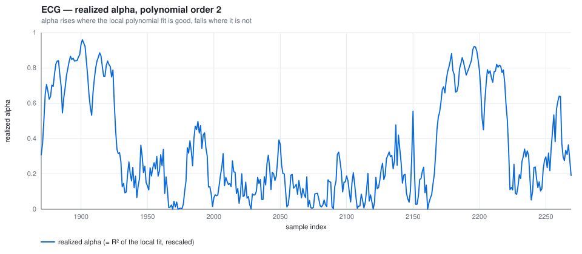
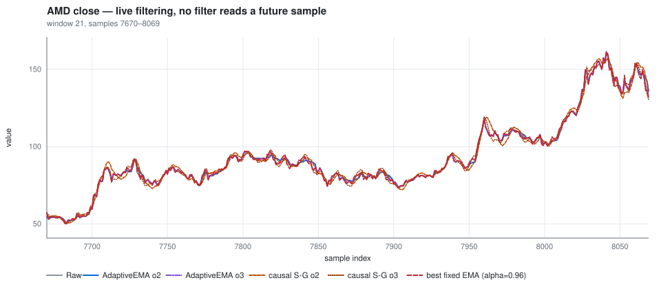
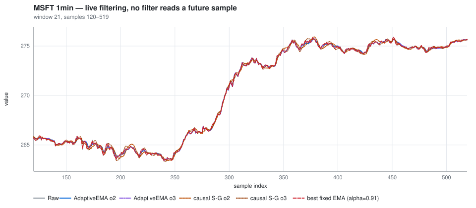
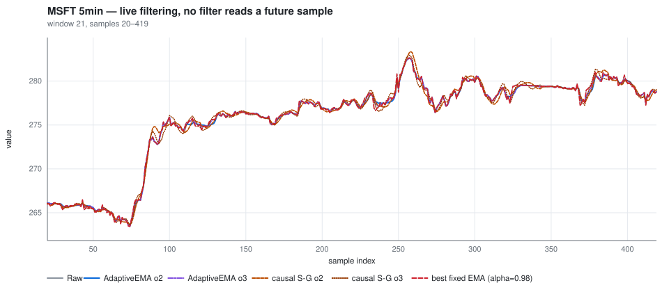
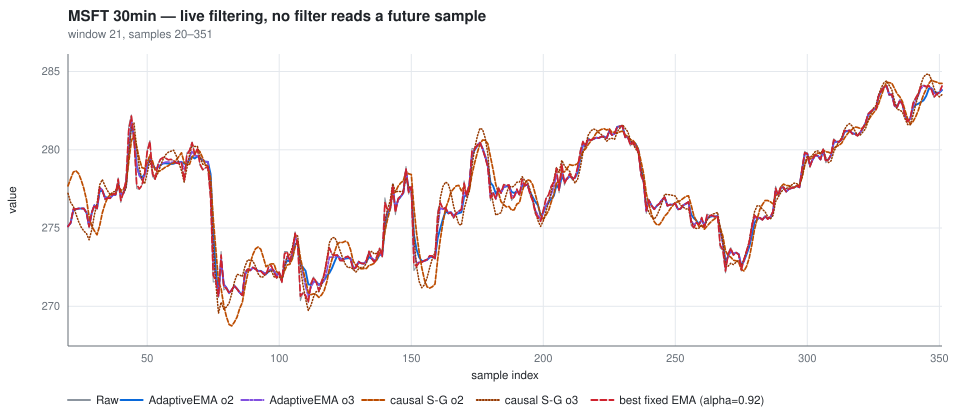
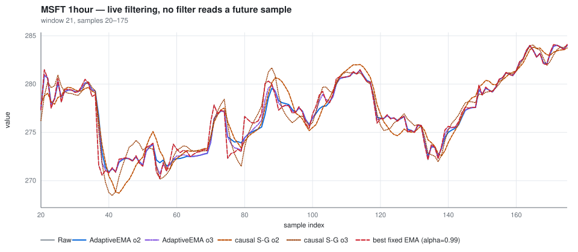

# Live filter comparison

Generated by the `FilterComparison` project. Regenerate with:

```bash
dotnet run -c Release --project FilterComparison/FilterComparison.csproj
```

## The test

Every filter here is **strictly causal** and uses a 21-sample trailing window. None reads
a future sample, and nothing in the scoring uses a future-looking reference either.

| filter | what it is |
|---|---|
| `RSquaredAdaptive` order 2 and 3 | this library — alpha driven by the R² of the local polynomial fit |
| causal Savitzky-Golay order 2 and 3 | polynomial fitted to the trailing window, evaluated at its **newest** sample |
| best fixed-alpha EMA | the constant alpha that scores best *on this dataset*, tuned per dataset |

> The **centered** Savitzky-Golay filter is excluded entirely. In its usual form it computes each
> output from samples *after* it, which is not available on a live stream. The causal form above is
> the same filter family restricted to what a real-time system can actually see.

> The fixed-alpha baseline is tuned per dataset against the very metric it is being scored on, so
> it holds an advantage no live user would have. Treat it as an upper bound on what a well-chosen
> constant could do, not as a fair opponent.

### The score

```
score = RMSE( filter output at n , raw at n+h ) / RMSE( raw at n , raw at n+h )
```

Each filter's output at time `n` is treated as its estimate of where the signal is *now*, and scored
on how well that predicts the next actual observation — against the same prediction made by the raw
last sample.

**Below 1.000 beats doing nothing. Above 1.000 is worse than not filtering at all.**

This is the one metric here that is not degenerate. Lag hurts it, because a filter that trails is
describing the past. Variance hurts it too, because a jittery estimate misses the next sample. A
filter has to get both right to score below 1, and it needs no ground truth and no zero-phase
reference to compute.

Supporting columns: `rho` is the roughness ratio `RMS(diff(output)) / RMS(diff(raw))` — how much
smoothing you actually get, where 1.0 is none. `overshoot` is how far the output escapes the range
of the samples it was computed from, as a fraction of that range.

## Result


On the ECG, **AdaptiveEMA (order 3)** is the best live filter tested, at **0.8592**.

On every price series, **nothing meaningfully beats the raw last sample.** The best fixed alpha
converges to near 1.0 — that is, to the identity filter — and every genuine smoother scores above
1.0. This is the random-walk result appearing empirically: the optimal one-step predictor of a
random walk is its last value, so smoothing can only add error. Filters may still be worth using
on price data for display, or to denoise a derived indicator — but not to track the level.

### Two things that run against intuition

**Causal Savitzky-Golay does badly here.** Evaluating a least-squares fit at the edge of its own
support behaves like extrapolation: it reaches the signal early, but pays for it in variance. On a
prediction criterion the variance dominates, and at order 2 it scores worse than not filtering.
That extrapolation also shows up as overshoot — it leaves the range of its own input window, which
a weighted average mathematically cannot do.

**Adaptation earns more than tuning — where there is structure to adapt to.** On the ECG the
adaptive filter beats the best constant alpha available, even though that constant was fitted to
this exact metric on this exact data. Varying alpha is doing real work there, not just landing on a
good average operating point. On the price series the ranking inverts: the tuned constant wins by
converging on the identity filter, which is the correct answer for a random walk and something no
amount of adaptation can improve on.

## All datasets

| dataset | filter | live h=1 | live h=5 | rho | overshoot max | mean alpha |
|---|---|---:|---:|---:|---:|---:|
| ECG | AdaptiveEMA (order 3) | 0.8592 | 0.9379 | 0.46 | 0 | 0.322 |
| ECG | AdaptiveEMA (order 2) | 0.8694 | 0.9493 | 0.416 | 0 | 0.266 |
| ECG | fixed-alpha EMA (alpha=0.57, tuned here) | 0.9066 | 0.9711 | 0.513 | 0 | — |
| ECG | Causal Savitzky-Golay (order 3) | 0.9720 | 0.9932 | 0.531 | 0.22 | — |
| ECG | Causal Savitzky-Golay (order 2) | 1.0078 | 1.0155 | 0.394 | 0.21 | — |
| AMD close | fixed-alpha EMA (alpha=0.96, tuned here) | 0.9993 | 0.9999 | 0.959 | 0 | — |
| AMD close | AdaptiveEMA (order 3) | 1.0540 | 1.0125 | 0.776 | 0 | 0.715 |
| AMD close | AdaptiveEMA (order 2) | 1.1229 | 1.0300 | 0.716 | 0 | 0.625 |
| AMD close | Causal Savitzky-Golay (order 3) | 1.2482 | 1.0758 | 0.726 | 0.27 | — |
| AMD close | Causal Savitzky-Golay (order 2) | 1.4308 | 1.0923 | 0.577 | 0.26 | — |
| MSFT 1min | fixed-alpha EMA (alpha=0.91, tuned here) | 0.9958 | 0.9989 | 0.905 | 0 | — |
| MSFT 1min | AdaptiveEMA (order 3) | 1.0437 | 1.0079 | 0.727 | 0 | 0.656 |
| MSFT 1min | AdaptiveEMA (order 2) | 1.1019 | 1.0189 | 0.651 | 0 | 0.567 |
| MSFT 1min | Causal Savitzky-Golay (order 3) | 1.2015 | 1.0536 | 0.689 | 0.26 | — |
| MSFT 1min | Causal Savitzky-Golay (order 2) | 1.3462 | 1.0890 | 0.542 | 0.26 | — |
| MSFT 5min | fixed-alpha EMA (alpha=0.98, tuned here) | 0.9998 | 1.0001 | 0.98 | 0 | — |
| MSFT 5min | AdaptiveEMA (order 3) | 1.0795 | 1.0176 | 0.766 | 0 | 0.657 |
| MSFT 5min | AdaptiveEMA (order 2) | 1.1383 | 1.0275 | 0.712 | 0 | 0.569 |
| MSFT 5min | Causal Savitzky-Golay (order 3) | 1.2704 | 1.0511 | 0.734 | 0.26 | — |
| MSFT 5min | Causal Savitzky-Golay (order 2) | 1.3956 | 1.0552 | 0.579 | 0.24 | — |
| MSFT 30min | fixed-alpha EMA (alpha=0.92, tuned here) | 0.9967 | 0.9970 | 0.916 | 0 | — |
| MSFT 30min | AdaptiveEMA (order 3) | 1.0497 | 1.0058 | 0.742 | 0 | 0.697 |
| MSFT 30min | AdaptiveEMA (order 2) | 1.1227 | 1.0162 | 0.653 | 0 | 0.596 |
| MSFT 30min | Causal Savitzky-Golay (order 3) | 1.2450 | 1.0819 | 0.717 | 0.3 | — |
| MSFT 30min | Causal Savitzky-Golay (order 2) | 1.4807 | 1.1290 | 0.569 | 0.24 | — |
| MSFT 1hour | fixed-alpha EMA (alpha=0.99, tuned here) | 1.0000 | 0.9994 | 0.99 | 0 | — |
| MSFT 1hour | AdaptiveEMA (order 3) | 1.1339 | 1.0098 | 0.741 | 0 | 0.693 |
| MSFT 1hour | AdaptiveEMA (order 2) | 1.1888 | 1.0162 | 0.68 | 0 | 0.613 |
| MSFT 1hour | Causal Savitzky-Golay (order 3) | 1.3097 | 1.0564 | 0.734 | 0.19 | — |
| MSFT 1hour | Causal Savitzky-Golay (order 2) | 1.4178 | 1.0619 | 0.549 | 0.23 | — |

## ECG

`N = 3600`, scored on 3580 samples after the warm-up.


The mechanism — alpha is the R² of the local fit, rescaled into the decay range:




## AMD close

`N = 8298`, scored on 8278 samples after the warm-up.



## MSFT 1min

`N = 7465`, scored on 7445 samples after the warm-up.



## MSFT 5min

`N = 1949`, scored on 1929 samples after the warm-up.



## MSFT 30min

`N = 352`, scored on 332 samples after the warm-up.



## MSFT 1hour

`N = 176`, scored on 156 samples after the warm-up.



